## Úvod

**Obsah**
* [Registrace](#registrace)
* [Nastavení](#nastavení)
  * [Další konfigurace](#další-konfigurace)
  * [Nastavení z dalších aplikací](#nastavení-některých-aplikací)
  * [Vytvoření uživatelů](#vytvoření-uživatelů)
  * [Vytvoření skupin](#vytvoření-skupin)
  * [Konfigurace-dns](konfigurace-dns)
  * [Některé další možnosti nastavení](další-možnosti-nastavení)
* [Organizace videokonference](#organizace-online-videkonference)
* [Nahrávání videokonference](#nahrávání-videokonference)

[Gsuite](https://gsuite.google.com) je sada nástrojů pro kancelářskou práci od společnosti Google. Je pravděpodobné, že některou z částí Gsuite už využíváte (Gmail pro e-mail, Calendar pro kalendář, možná sdílíte dokumenty v Google docs). Gsuite balí tyto nástroje do jednoho balíku a nabízí je organizacím pro jejich práci.

Funguje to tak, že nějaká firma nebo škola převede větší nebo menší část své online agendy na služby Googlu. Všichni uživatelé v rámci organizace budou mít svůj účet s koncovkou např. `nase-skola.cz`. Přihlásí se do e-mailu jako `petr.ucitel@nase-skola.cz` - a dostane známé zozhraní ze služby Gmail. V rámci organizace může s kolegy sdílet kalendář, pracovat na dokumentech. Google pro vás vytvoří privátní prostor pro spolupráci a dávám do něj svoje služby.

[Classroom](https://classroom.google.com) je jedna ze služeb Googlu, kterou možná ještě neznáte. Je to vedle e-mailu nebo kalendáře další z aplikací, která vám umožní spolupracovat ve více lidech - a tentokrát je zaměřená na práci ve třídě při vyučování. Umožní vám organizovat výuku, zvát žáky na kurzy, vypisovat testy, přejímat domácí úkoly. Funguje to skvěle a není to tak složité, jak to může vypadat.

Všechno běží v prohlížeči - v minimální verzi se se to používat na tabletech. Nic se nikde neinstaluje. Potřebujete pouze moderní webový prohlížeč (Firefox, Chrome, Edge. Pozor: Internet Explorer není ani moderní, ani prohlížeč, jeho podpora byla dávno zastavena. Nepoužívejte Internet Explorer)

**Otázka: Musíme mít jako škola zařízený Gsuite, abychom mohli využívat classroom** - Ne, classroom můžete docela dobře používat na svém soukromém `gmail.com` účtu. 

**Otázka: Máme produkt MS Office 365, je to pro nás?** - Pokud jste s Office 365 spokojení, tak je pro vás pravděpodobně vhodnější služba [Teams](microsoft-teams)

**Otázka: Slyšeli jsme o open source, není něco k dispozici?** - Je to trochu víc improvizace, ale dáse to, viz [Otevřený software](oss)

**Otázka: Kolik celý ten balík stojí? Jsme chudá vesnická škola** - Gsuite pro školy je zdarma! Firmy platí minimálně $5/uživatel/měsíc (2020-03)

**Otázka: Máme nějak nastavené e-maily a nějak nám to chodí, bojíme se přejít na Gmail/Gsuite** - Gmailu se nebojte, je to osvědčené řešení pro firmy i jednotlivce, nastavení probíhá dobře. Pokud ale přesto nechcete přejít hned s e-maily na Gmail, nemusíte.

**Otázka: Mám již G-Suite v programu nezisková organizace/non-profit, mohu použít i pro školu?** - Rozdíl mezi non-profit a education je pouze v tom, že G-Suite for Education umožňuje přidávat i uživatele mladší 18-ti let. Pokud si nastaví uživatel v non-profit programu věk nižší než 18 let, Google účet automaticky zablokuje a nelze ho do budoucna obnovit.

## Registrace

Pokud jste se rozhodli používat na vaší škole Gsuite, musíte projít instalací a konfigurací

### Co potřebujete

* Potřebujete mít k ruce někoho, kdo se vám stará o stránky a má přistup ke správě domény např. `nase-skola.cz`. Tohle opravdu potřebujete. Potřebujete ho alespoň na dálku, aby věděl co se chystá a pomohl vám. Ideálně, aby následující kroky provedl sám.
* Potřebujete školní mobilní telefon
* Potřebujete nějakou e-mailovou adresu pro iniciační založení

### Registrace Gsuite

Odkaz pro školy je https://gsuite.google.com/signup/edu/welcome

1. 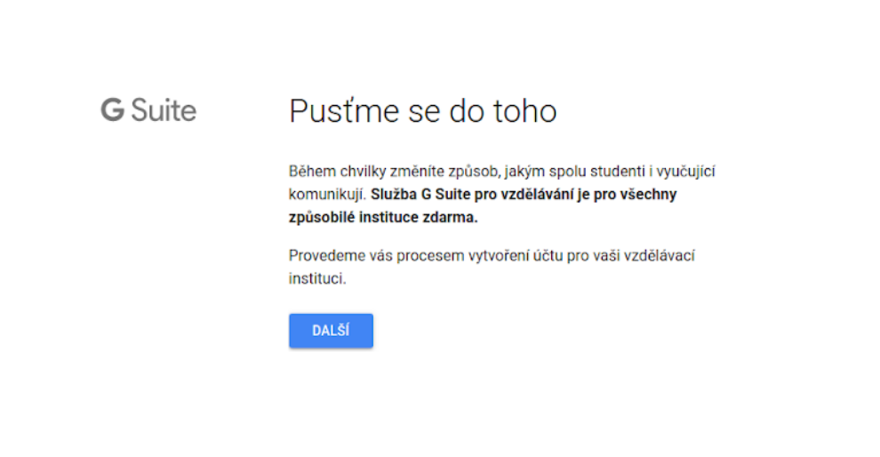
   Klikněte na tlačítko `Další` pro spuštění registrace

2. 
   Zadejte název školy a o jaký typ školy se jedná

3. 
    Musíte vyplnit doménu školy, pokud už nějakou máte. Pokud ji nemáte, musíte ji nejprve založit. Spojte se člověkem, který se vám stará o počítače nebo se zřizovatelem.

4. 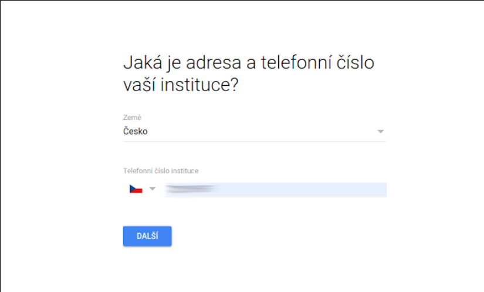
   Je potřeba svázat váš administrátorský účet s telefonním číslem - použijte mobilní, můžete-li, usnadníte tak pozdější proceduru ověřování (potřebujete číst SMS).

5. 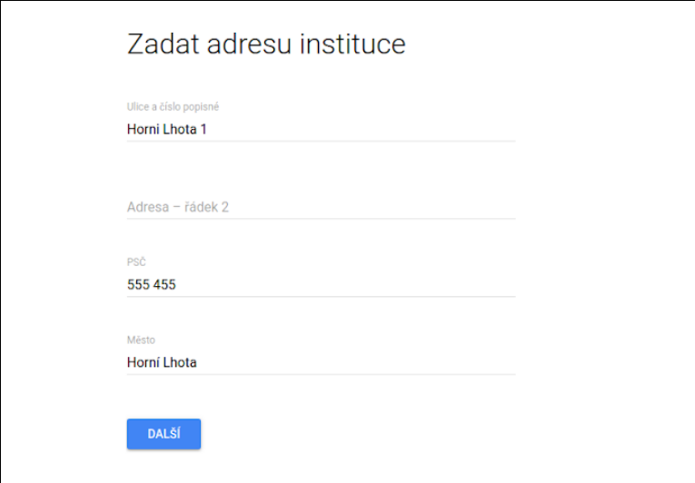
   Zadejte fyzickou adresu

6. 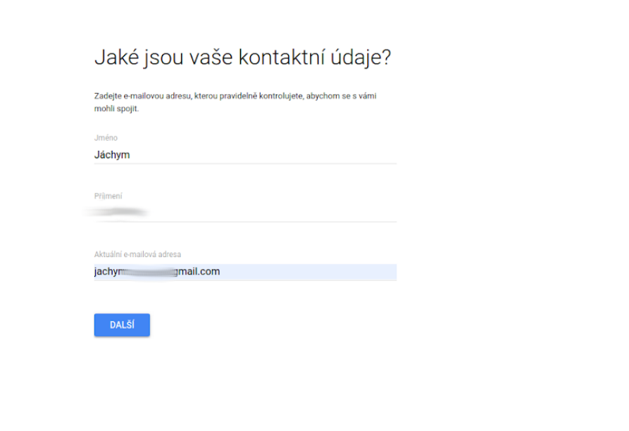
   Zadejte své jméno a jakoukoliv administrátorskou e-mailovou adresu. Pro administrování budete později používat jiný účet, tato adresa slouží pro první nastavení a jako záložní komunikace

7. 
   Zvolte doménu školy 

8. 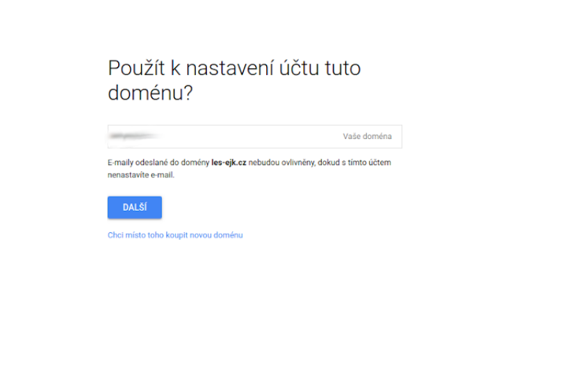
   My už doménu máme, jdeme dál. Na tomto místě máme možnost zaregistrovat úplně novou doménu. Pokud doménu nemáte, dohodněte se se svým zřizovatelem (Obcí), nebo poskytovatelem internetového připojení - bude si vědět rady. Nepotřebujete vlastní doménu (skola.cz), můžete klidně fungovat na tzv. “Subdoméně” - tedy např. skola.obec.cz

9. 
   Nyní vytvoříme prvního administrátorského uživatele

10. 
   Google vám může a nemusí psát, znáte to ...

11. 
   Dáváte souhlas s použitím služby G Suite pro vzdělání

12. 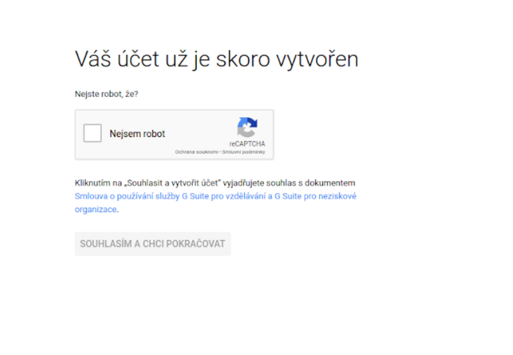
   Ověřte, že nejste robot

13. 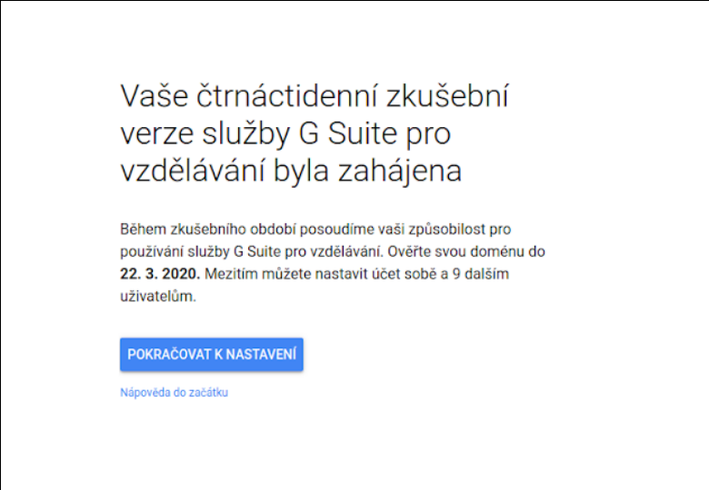
    Máme 14 dní zkušební dobu že jste škola. Zřídili jsme "horkou linku" mezi Googlem a GUG, jsme schopni zorganizovat ověření do jednoho dne - napište. Pokračujte k nastavení

14. 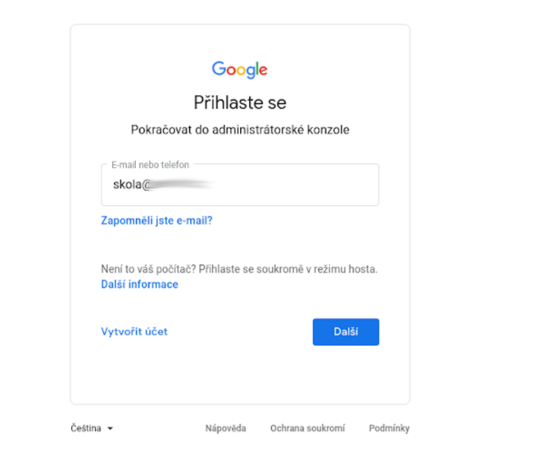
  Přihlaste se pod svým novým administrátorským účtem vaší školy

15. 
   Musíte se ještě ověřit pomocí SMS - zadejte telefon, který jste použili pro registraci

16. 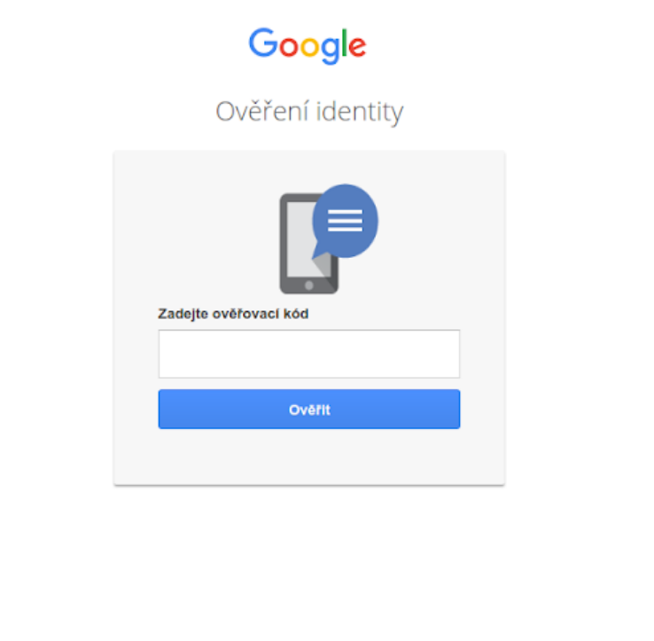
   Zadejte kód v SMS

17. 
   Opět potvrďte souhlas s podmínkami používání

18. 
   Gratulujeme, máte nastaveno, jste v administrátorské konzoli. Ještě pár drobností

19. 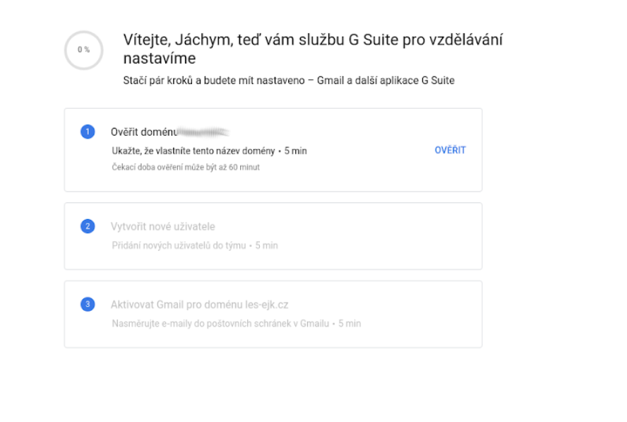
   Teď musíme ověřit Googlu, že ta doména je opravdu naše. Tento krok můžete přeskočit - nebude vám fungovat online videokonfernece, ale službu classroom budete moct využívat. Doménu můžete ověřit později, až se dostanete k technikovi, který vám poradí. Tady potřebujete vašeho technika - bude vědět, co dělat. Pokud máte tak zvaný FTP přístup ke svým stránkám, můžete to zvládnout i sami.

20. Další krok by pak měl být Upgrade Request viz https://youtu.be/NJsCFZnLoac

## Nastavení

Gsuite je myšleno tak, že uživatelé jsou pouze z vaší domény - mají nějaký účet jako `sanda.koprnikova@moje-skola.cz` - a nidko jiný do učeben (Classrooms) přístup nemá. Zřídit účty všem se dá udělat celkem rychle z "excelovské tabulky" (POZNAMKA: doplnit link jak na to). To ale může být problém - z nějakého dovodu to nechcete nebo nemůžete dělat. V tom případě můžete zpřístupnit své kurzy uživatelům i mimo doménu - pouze musí mít přístup k nějakému účtu u Google.

1. V Gsuite admin konzoli zadejte do horního hledání Classroom, rozklikněte první odkaz. https://admin.google.com/
   

2. V Class Settings upravte možnosti kdo se může připojit.
   

3. Nastavme oboje na Any user, to znamená, že kdokoliv se může připojit a já se můžu připojit kamkoliv (ta druhá možnost je teď jedno). Pokud volíte whitelisted domény (konečný seznam několika povolených domén, ze kterých se mohou uživatelé připojovat) nastavují dole.
   

### Další konfigurace

Po ověření domény nastavíme org. jednotky (příklad nastavení)

* Ucitele
* Zamestnanci (pro správní zaměstnance)
* Zaci
  * 2019 (rok nástupu do školy)
  * 2018

### Nastavení některých aplikací

#### Adresář

* vlevo nahoře burger menu - adresář - nastavení adresáře
* Sdílení kontaktů - Povolit (tím bude fungovat našeptávač)

## Vytvoření uživatelů

Uživatele vytvořím pomocí CSV souboru (v CSV je nutno zadat cestu k org. jednotce, proto je dobré vytvořit jednoduchou strukturu.

**Na co dát pozor:**

* diakritika v CSV souboru (zkontrolovat na několika cvičných účtech)
* někteří žáci mají dvě jména, domluvit se se školou na podobě emailu 
* více stejných jmen a příjmení - kontrola v tabulce na duplicity (Excel umí v podmíněném formátování) - G tabulky přes funkci COUNTIFT a pak si setřídit
* tvorba e-mailovách adres v G-tabulky (Excel) kdy jsou jména a příjmení s diakritikou funkce DOSADIT
* Šablona pro tvorbu emailových adres https://docs.google.com/spreadsheets/d/13KQ8Rr4DiBfDqMQPGH998KCLHELN7fUSXXH_l5Z7Hes/edit?usp=sharing kontroluje nově i duplicity

### Vytvoření skupin

* Domluvit se školou na jejich podobě (napr. 1a@, ucitele@)
* Vyvořit skupiny a v nastavení oprávnění zvolit, že číst zprávy mohou jen členové skupiny a ne celá organizace.
* Po vytvoření skupin nahrát uživatele pomocí CSV (utf 16)
* Šablony pro CSV jsou ke stažení přímo v admin konzoli (pokud zvolíte hromadné vytváření uživatelů nebo skupin.
* Do automaticky vytvořené skupiny “Teacher group” vložit učitele (tím zajístíme, že mohou vytvářet kurzy v Učebně).

### Konfigurace DNS

V drtivé většina největší úskalí. Na malých školách se jim o DNS stará někdo zvenčí, čekejte pomalé reakční doby i v řádu dnů. Proto doporučuji se hned na úvod domluvit s vedením školy, ať zjistí přístupové údaje k DNS a předá vám je.

V DNS kromě MX nastavit i DKIM a SPF. Pokud převádíte školu z Office 365, odstraňte původní SPF záznam (odkazující na Outlook), jinak vám nebudou chodit emaily např. ze Seznamu.

### Další možnosti nastavení

Na základkách v nižších ročnících chtějí omezit doručování (tz. emailem může žák komunikovat jen na ostatní školní účty). 

**Cesta k nastavení:** `Aplikace -> G Suite -> Gmail -> Rozšířená nastavení -> Omezení doručování`

**Zákaz sdílení mimo doménu:*  `Aplikace -> G Suite -> Disk Google -> Nastavení sdílení -> pro org. jednotku žáci nastavit na sdílení pouze v rámci domény`

## Organizace online videkonference
Pokud používáte Gsuite pro celou organizaci, budete využívate službu https://meet.google.com

Pokud naopak využíváte Classroom pouze na svém soukromém účtu, budete muset použít (starší, ale zatím spolehlivý) https://hangouts.google.com

1. Nejlépe "místnost pro telekonferenci" založíte tak, že navštívíte Kalendář google https://calendar.google.com
  

2. Kliknutím myši do nějakého dne můžete vytvořit novou událost a přiřadit k ní i "místo konání" (v mém případě Hangouts)
  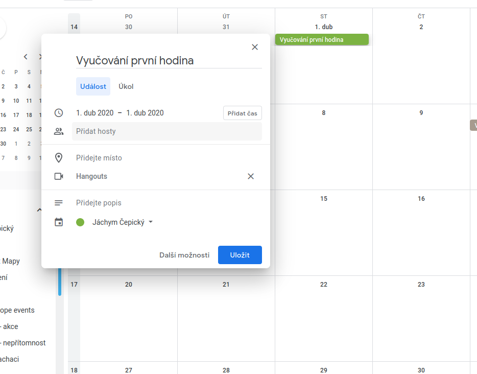

3. V detailu události můžete přizvat hosty k události pomocí jejich e-mailu
  

4. A při kliknutí na událost v kalendáři získáte odkaz (zde `Připojit ke slubě Hangouts`) který můžete dále sdílet.
  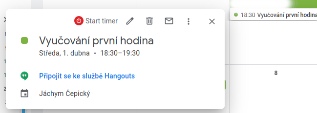

Všichni pozvaní dostanou e-mail s pozvánkou "na hangout" - a pokud máte Gsuite tak se vám link na videokonferenci (Meet) zobrazí v kalendáři kurzu.

## Nahrávání videokonference

**Poznámka** Platí pouze pro Meet v Gsuite, na Hangout musíte nahrávat nějakým jiným nástrojem

1. Je nutné vše nejprve povolit v Google Admin Consoli  https://admin.google.com/ 
     

2. Následně vybereme Meet settings
    

3. Zde nastavíme možnost streamovat a nahrávat
    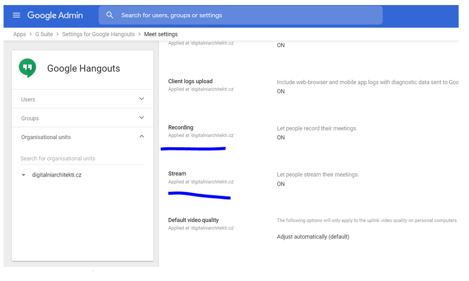

Vše se pak nastavuje v události v Google kalendáři, kdy při vytváření nové události založíte novou videokonferenci u ní pak povolíte livestream - viz část [Organizace videokonference](#organizace-online-videkonference)